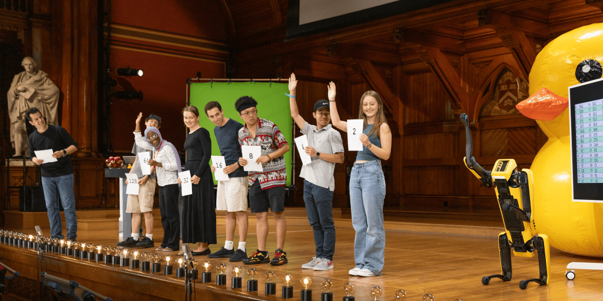
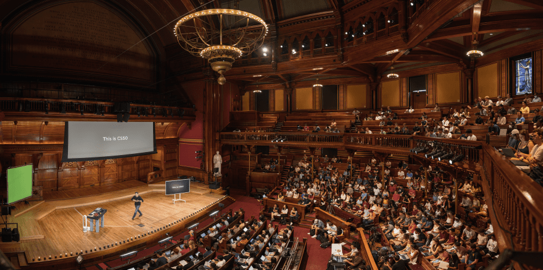
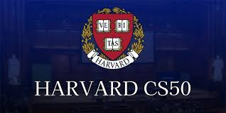

# CS50x - 2024

[General Information](https://pll.harvard.edu/course/cs50-introduction-computer-science)

[CS50: Introduction to Computer Science](https://cs50.harvard.edu/x/2024/)

## Course description
This is CS50, Harvard University's introductory course in computer science, open to both majors and non-majors. It's suitable for students with or without programming experience, emphasizing problem-solving with code as well as correctness, design, and style. The course begins with C, then progresses to Python, SQL, HTML, CSS, and JavaScript, covering fundamental concepts of computer science and programming principles. The course concludes with a final project.

## Topics
Abstraction, algorithms, data structures, encapsulation, resource management, security, software engineering, and web development.

## Languages
C, Python, SQL, JavaScript, CSS, HTM

## Objectives
- A broad and robust understanding of computer science and programming

- How to think algorithmically and solve programming problems efficiently

- Concepts like abstraction, algorithms, data structures, encapsulation, resource management, security, software engineering, and web development

- Familiarity with a number of languages, including C, Python, SQL, and JavaScript plus CSS and HTML

- How to engage with a vibrant community of like-minded learners from all levels of experience

- How to develop and present a final programming project to your peers

## Practice Problems/Labs/Problem Sets
Week 0 - Scratch

- [Problem Sets 0](https://scratch.mit.edu/projects/1058200246)
- Computer Science, Computational Thinking
- Problem Solving: Inputs, Outputs
- Representation: Unary, Binary, Decimal, ASCII, Unicode, RGB
- Abstraction
- Algorithms
- Running Times
- Pseudocode
- Scratch: Functions, Arguments, Return Values, Variables,Boolean Expressions, Conditionals, Loops, Events, Threads

## Useful resources

## Tips
- Test your code with different inputs. check50 does not find some errors!

_Please note that this repository is for storing my projects and files from Harvard University's CS50x course. It is not meant for sharing answers or encouraging academic dishonesty. If you are currently enrolled, please complete the assignments independently and refer to the course materials._